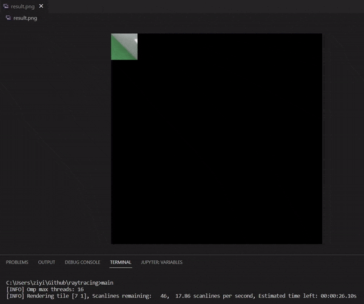
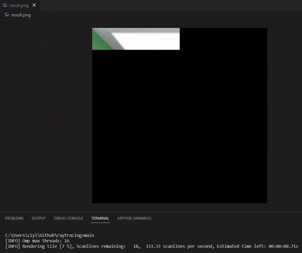
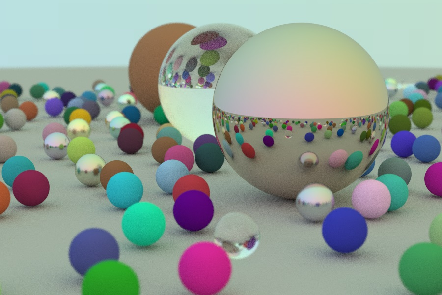

# Simple Ray Tracing



> Cornell Box, size: 512 * 512, SPP: 250, max depth: 50, playback rate: 30X



> Mesh in Cornell Box, size: 256 * 256, SPP: 150, max depth: 50, playback rate: 10X

Unfiltered Result    |  Bilateral Filtered Result
:-------------------------:|:-------------------------:
  |  

A simple ray tracing renderer with CPU based on **Peter Shirley's Ray Tracing Tutorial** with some modification including:

- [x] omp parallel acceleration
- [x] triangle object
- [x] tiling render
- [x] instance with quaternion rotation
- [x] rendering obj mesh

## Reference

- Peter Shirley. Ray Tracing in One Weekend 
https://raytracing.github.io/books/RayTracingInOneWeekend.html
- Peter Shirley. Ray Tracing the Next Week
https://raytracing.github.io/books/RayTracingTheNextWeek.html
  
## Dependencies

- GLM for linear algebra https://github.com/g-truc/glm
- Tinyobjloader for loading meshes https://github.com/tinyobjloader/tinyobjloader
- STB for image IO https://github.com/nothings/stb

## Compile

Clone the project with all **thirdparty submodules**

```shell
git clone --recursive https://github.com/LuniumLuk/raytracing.git
```

Compile with Makefile

```shell
make

make run
```

or Compile with C++ compiler, since this project has only one .cpp file

```shell
g++ -std=c++11 -Isrc -o main -c src/main.cpp
```